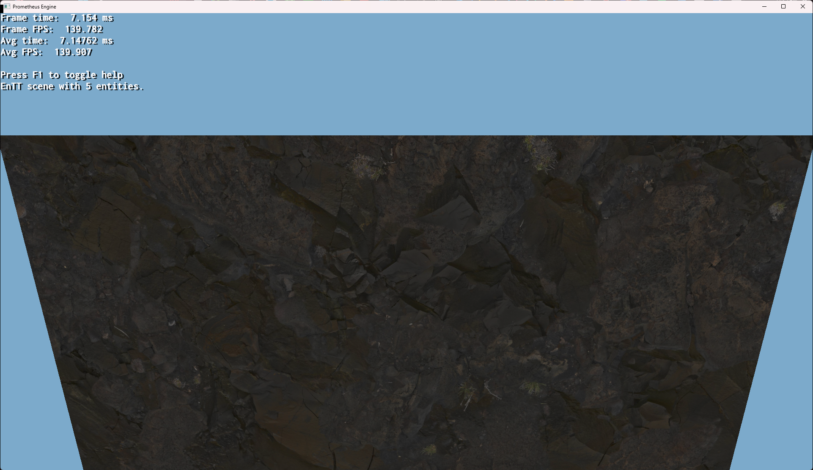
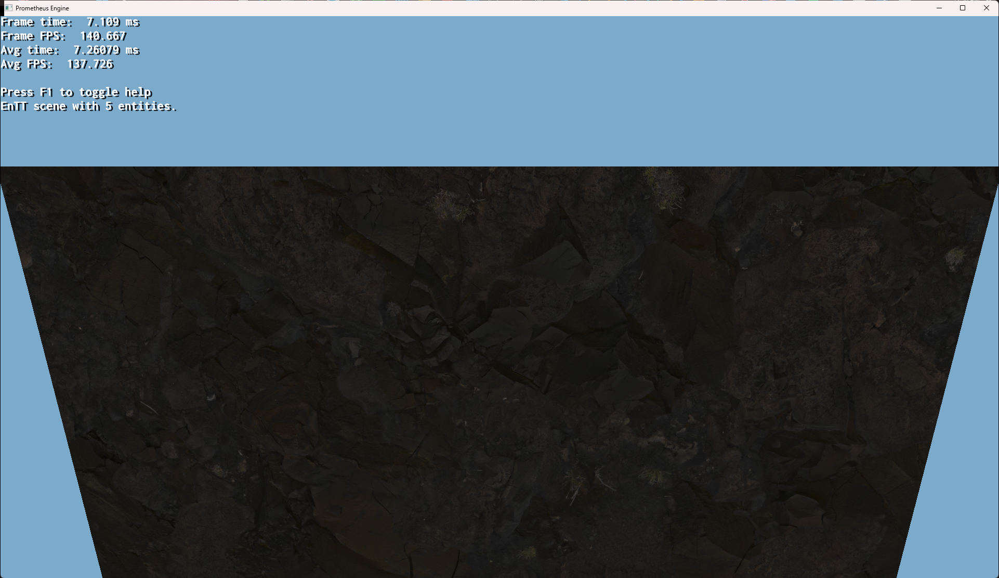
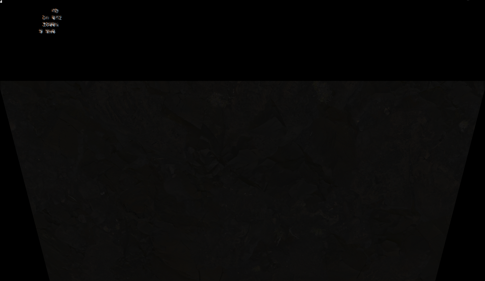
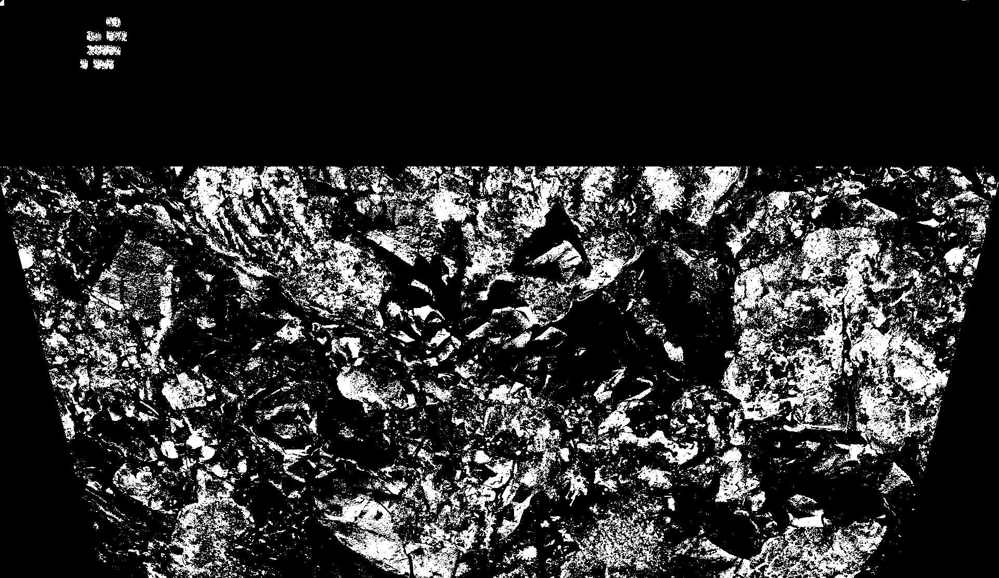

# Ambient occlusion in Ogre-Next's HLMS PBS

Ogre-Next's PBS material system had no ambient occlusion texture slot. Adding
one meant working inside HLMS (High Level Material System), the shader
generator that assembles PBS pixel shaders from template pieces at runtime
based on which features a material actually uses.

The work spans 12 files and about 215 lines across the
[ogre-next fork](https://github.com/JacobGroover/ogre-next), on the
`ambient-occlusion` branch. It touches four layers: the texture type enum, the
datablock that owns per-material state, the GPU const buffer upload, and the
generated shader itself.

## The texture type enum

`PbsTextureTypes` is the list of texture slots a PBS material can carry.
Upstream it ended like this:

```cpp
PBSM_EMISSIVE,
PBSM_REFLECTION,
NUM_PBSM_SOURCES = PBSM_REFLECTION,
NUM_PBSM_TEXTURE_TYPES
```

`PBSM_AO` goes in after `PBSM_REFLECTION`, which makes it slot 15 and brings
the count to 16. The subtlety is the two trailing counters. `NUM_PBSM_SOURCES`
counts slots that feed the shading equation; `NUM_PBSM_TEXTURE_TYPES` counts
texture slots. Upstream they legitimately differ, because reflection is a
texture but not a lighting source.

Declaring `NUM_PBSM_TEXTURE_TYPES` with no initializer makes it whatever the
previous enumerator is plus one. Once `NUM_PBSM_SOURCES` was redefined as
`PBSM_AO + 1`, that implicit increment produced 17 rather than 16, so the two
counts silently disagreed by one:

```cpp
PBSM_REFLECTION,
PBSM_AO,
NUM_PBSM_SOURCES = PBSM_AO + 1,
NUM_PBSM_TEXTURE_TYPES = NUM_PBSM_SOURCES   // was: implicit, and one too many
```

## The const buffer upload

The off-by-one above surfaced in `HlmsPbsDatablock::uploadToConstBuffer`, which
packs material state into the GPU buffer. The function built a local array sized
by one constant and then advanced the write pointer by the size of a *different*
array:

```cpp
uint16 texIndices[NUM_PBSM_TEXTURE_TYPES];      // was: OGRE_NumTexIndices
for( size_t i = 0; i < NUM_PBSM_TEXTURE_TYPES; ++i )
    texIndices[i] = mTexIndices[i] & ~ManualTexIndexBit;

memcpy( dstPtr, &mBgDiffuse[0], MaterialSizeInGpu - sizeof( mTexIndices ) );
dstPtr += MaterialSizeInGpu - sizeof( texIndices );   // was: sizeof( mTexIndices )
memcpy( dstPtr, texIndices, sizeof( texIndices ) );
```

With the local array and the member array disagreeing on length, the offset
arithmetic wrote the texture indices to the wrong place in the buffer. Making
both sides use the same constant fixes it.

## Preserving the GPU struct layout

The material struct is mirrored between C++ and shader code, so its layout
cannot shift. Rather than append a field and shift everything after it, the AO
factor takes over an existing padding slot:

```cpp
float mClearCoat;
float mClearCoatRoughness;
float mAo;  // replaced float _padding1 with mAo to preserve memory layout
float mUserValue[3][4];
```

## The shader pieces

HLMS assembles shaders from `.any` template pieces, with `@property(...)`
blocks compiled in only when a material declares that feature. The AO path adds
a `SampleAoMap` piece:

```
@piece( SampleAoMap )
    /// AMBIENT OCCLUSION MAP
    pixelData.ao = midf_c( material.ao );
    @property( ao_map )
        midf aoSample = SampleAo( textureMaps@value( ao_map_idx ),
                                  samplerState@value( ao_map_sampler ),
                                  UV_AO( inPs.uv@value(uv_ao).xy ),
                                  texIndex_aoIdx ).x;
        // A power of 1.0 is "Real" and default for ambient occlusion equation.
        pixelData.ao *= pow( aoSample, _h( 4.0 ) );
    @end
@end
```

The sampled value is raised to a power before being applied, which makes the
effect adjustable rather than a straight multiply. The occlusion term is then
applied in `AmbientLighting_piece_ps.any`, so it attenuates ambient light only
and leaves direct lighting untouched, which is what ambient occlusion is
supposed to do.

Supporting changes register the texture in the vertex shader's texture
registers, add `ao` to the shared pixel data struct, and extend the UV modifier
macros so the AO map can carry its own UV transform. `OgreHlmsJsonPbs.cpp`
parses the slot from material JSON so the scene format can drive it.

## Results

The sample scene, rendered with the same material and lighting in both cases.

**Without ambient occlusion**



**With ambient occlusion**



The difference is deliberately subtle at normal exposure, so the next two
isolate it. The first is a per-pixel albedo difference between the two renders
above, showing only what the AO term changed.



The second converts that difference to grayscale and magnifies it, so the areas
where occlusion contributes most stand out.



Removing the albedo texture from the material while leaving the others in place
makes the effect much easier to see directly, since albedo detail otherwise
masks it.
